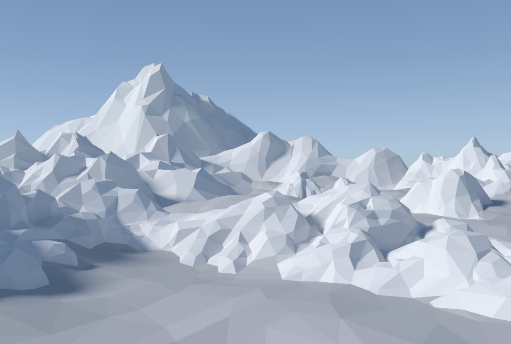

<PageDescription>

Developing an Extended Reality application will require the usage of 3D assets such as 3D models.

</PageDescription>

To accelerate the creation of your prototype, please feel free to use existing content in 3D asset stores such as

- [3D Animations & Models | Unity Asset Store](https://assetstore.unity.com/3d)
- [Unreal Engine Marketplace | Store of UE Assets for Games and 3D Rendering - UE Marketplace](https://www.unrealengine.com/marketplace/en-US/store)

If the desired 3D asset entails costs, please reach out to us on Discord.
